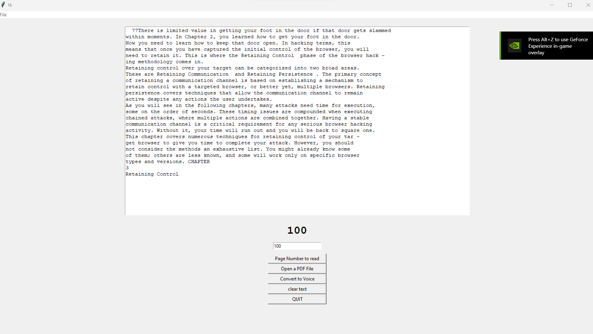

**Text-to-Voice GUI with Tkinter and gTTS**
This is an example of a text-to-voice GUI built with Tkinter and gTTS. This GUI allows the user to enter text into a text field and then convert that text to speech.

**Installation**
Before running the application, you will need to install the required libraries. You can do this using pip:
``py -m pip install requirements.txt  ``

**Usage**
To use the application, simply run the text_to_voice_gui.py file. This will open a window with a text field and  buttons.

**#To convert text to speech, enter the text you want to convert into the text field and click the  button. The application will use gTTS to convert the text to an MP3 file, and then play the MP3 file using os.

Code
The code for this application is written in Python and uses the Tkinter and gTTS libraries. You can find the code in the tkinter_tester.py file.

**Contributing**
If you find a bug or would like to suggest a new feature, please create an issue on the GitHub repository. If you would like to contribute code, please create a pull request.

*License*
This project is licensed under the MIT License. See the LICENSE file for details.
